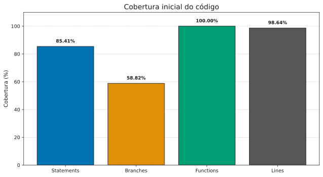
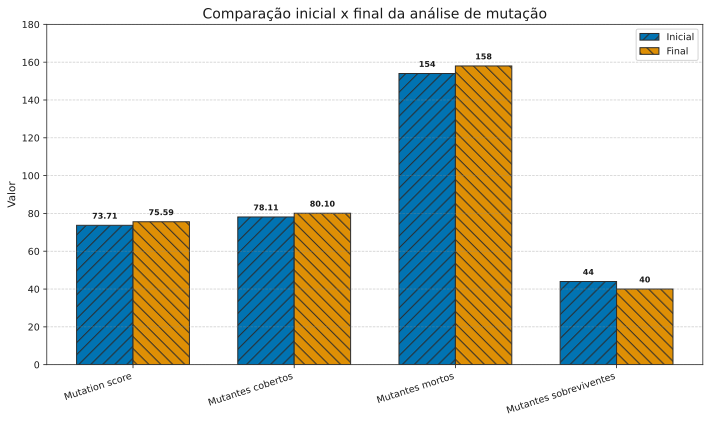
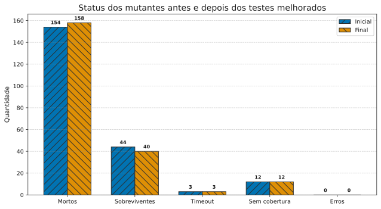

# Analise de Eficacia de Testes com Teste de Mutacao

**Disciplina:** Testes de Software  
**Trabalho:** Analise de Eficacia de Testes com Teste de Mutacao  
**Aluno(a):** Joana Morais  
**Professor:** Cleiton Tavares
**Repositorio:** `operacoes-mutante`

## 1. Analise inicial

Este trabalho avaliou a eficacia de uma suite de testes JavaScript utilizando Jest e StrykerJS. O projeto contem 50 operacoes matematicas e uma suite inicial de testes com alta cobertura de codigo, mas com assercoes insuficientemente especificas.

O teste de mutacao introduz alteracoes controladas no codigo para verificar se os testes conseguem detectar mudancas no comportamento esperado.

A tabela a seguir apresenta os seguintes resultados: `Statements` representa a proporcao de instrucoes executadas; `Branches`, a proporcao de caminhos condicionais executados; `Functions`, a proporcao de funcoes chamadas; e `Lines`, a proporcao de linhas executadas. Esses indicadores mostram quanto do codigo foi exercitado, mas nao avaliam a qualidade das assercoes.

<div align="center">

| Metrica    | Resultado |
| ---------- | --------: |
| Statements |    85,41% |
| Branches   |    58,82% |
| Functions  |      100% |
| Lines      |    98,64% |

</div>

*Tabela 1. Cobertura inicial do código. A maior parte das linhas e funções foi executada, mas a baixa taxa de branches revela caminhos condicionais ainda pouco explorados.*



*Figura 1. Distribuição da cobertura inicial por categoria de código. O gráfico reforça que a execução do código foi ampla, mas insuficiente para garantir a qualidade das verificações.*

A analise inicial de mutacao apresentou os resultados na tabela abaixo: `Mutation score` indica a proporcao de mutantes efetivamente detectados; `Mutantes cobertos` indica os mutantes alcancados por pelo menos um teste; `Mutantes mortos` sao aqueles detectados; `Mutantes sobreviventes` nao foram detectados; `timeout` indica execucao excedida; `sem cobertura` indica que nenhum teste alcancou o trecho; e `Erros` representa falhas de execucao do processo de mutacao.

<div align="center">

| Metrica                | Resultado |
| ---------------------- | --------: |
| Mutation score         |    73,71% |
| Mutantes cobertos      |    78,11% |
| Mutantes mortos        |       154 |
| Mutantes sobreviventes |        44 |
| Mutantes com timeout   |         3 |
| Mutantes sem cobertura |        12 |
| Erros                  |         0 |

</div>

*Tabela 2. Resultado inicial da análise de mutação. O score indica que parte dos mutantes foi detectada, mas a taxa de sobrevivência ainda mostra fragilidades relevantes na suíte.*

A diferenca demonstra que cobertura de codigo nao e suficiente para avaliar a qualidade de uma suite de testes. A cobertura mostra que instrucoes, funcoes ou linhas foram executadas, mas nao garante que os resultados tenham sido validados corretamente.

Os 44 mutantes sobreviventes indicaram que alteracoes no comportamento do codigo podiam passar despercebidas. Alguns testes verificavam apenas se um erro era lancado, sem validar sua mensagem, ou utilizavam entradas que nao evidenciavam alteracoes nos operadores aritmeticos.

## 2. Analise de mutantes criticos

Os mutantes abaixo foram selecionados entre os sobreviventes da primeira execucao por representarem tres fraquezas diferentes: ausencia de teste para um caminho condicional, assercao de excecao pouco especifica e entrada numerica incapaz de distinguir formulas aritmeticas.

**Evidencia visual:** o relatorio HTML completo esta disponivel em [../reports/mutation/mutation.html](../reports/mutation/mutation.html). Nele, os mutantes aparecem com o status `Survived` e com a localizacao correspondente no arquivo `src/operacoes.js`. Para a versao PDF, devem ser inseridas capturas de tela das tres entradas selecionadas nesse relatorio.

### 3.1 ConditionalExpression em `mediaArray`

**Mutante:** `ConditionalExpression Survived (25:7)`

A funcao original contem a condicao:

```javascript
function mediaArray(numeros) {
  if (numeros.length === 0) return 0;
  return somaArray(numeros) / numeros.length;
}
```

O mutante alterou a expressao condicional, fazendo com que a condicao fosse sempre falsa, por exemplo:

```javascript
if (false) return 0;
```

O teste original utilizava apenas um array com elementos:

```javascript
expect(mediaArray([10, 20, 30])).toBe(20);
```

Nesse caso, `numeros.length === 0` ja era falso no codigo original. Assim, o codigo original e o mutado retornavam `20`. Como o teste nao verificava o comportamento para um array vazio, ele nao detectou a alteracao.

### 3.2 StringLiteral em `divisao`

**Mutante:** `StringLiteral Survived (8:32)`

A funcao original lanca um erro com uma mensagem especifica:

```javascript
throw new Error('Divisão por zero não é permitida.');
```

O mutante substituiu o texto da mensagem por outro literal, como uma string vazia:

```javascript
throw new Error('');
```

O teste original era:

```javascript
expect(() => divisao(5, 0)).toThrow();
```

Essa assercao verificava somente se algum erro era lancado. Como o codigo mutado tambem lancava uma excecao, o teste continuava passando. A mensagem nao era validada, permitindo que o mutante sobrevivesse.

### 3.3 ArithmeticOperator em `celsiusParaFahrenheit`

**Mutante:** `ArithmeticOperator Survived (93:51)`

A funcao original utiliza a seguinte formula:

```javascript
function celsiusParaFahrenheit(celsius) {
  return (celsius * 9 / 5) + 32;
}
```

O mutante substituiu um dos operadores aritmeticos da formula.

O teste original utilizava `0`:

```javascript
expect(celsiusParaFahrenheit(0)).toBe(32);
```

Esse valor nao evidenciava a alteracao porque diferentes operacoes aplicadas a zero podiam continuar produzindo zero. Depois da soma de `32`, o resultado permanecia `32` no codigo original e no mutado.

## 3. Solucao implementada

Foram adicionados tres casos de teste, cada um direcionado a um dos mutantes analisados. Os testes foram executados com Jest para confirmar que continuam passando contra o codigo original.

### 4.1 Array vazio

```javascript
test('deve retornar 0 para um array vazio', () => {
  expect(mediaArray([])).toBe(0);
});
```

O teste verifica explicitamente o caminho em que o array esta vazio. No codigo original, o resultado e `0`. Com a condicao mutada, a funcao nao executa esse retorno e produz `NaN`, fazendo a assercao falhar.

### 4.2 Mensagem da divisao por zero

```javascript
test('deve informar a mensagem correta ao dividir por zero', () => {
  expect(() => divisao(5, 0)).toThrow(
    'Divisão por zero não é permitida.'
  );
});
```

Esse teste valida o conteudo da mensagem da excecao. Se o Stryker substituir a mensagem por uma string vazia ou outro texto, a assercao falha e o mutante e identificado.

### 4.3 Conversao de Celsius para Fahrenheit

```javascript
test('deve converter 100 Celsius para 212 Fahrenheit', () => {
  expect(celsiusParaFahrenheit(100)).toBe(212);
});
```

O valor `100` evidencia a formula completa:

```text
(100 * 9 / 5) + 32 = 212
```

Alteracoes nos operadores de multiplicacao ou divisao produzem um resultado diferente de `212`. Assim, o teste detecta a mutacao aritmetica que permanecia invisivel com a entrada `0`.

## 4. Resultados finais

Depois da inclusao dos novos testes, a analise apresentou os seguintes resultados: a coluna `Inicial` mostra a situacao antes das melhorias; `Final`, a situacao depois dos novos testes; e `Variacao`, a diferenca entre os dois resultados. Valores positivos indicam aumento, enquanto valores negativos indicam reducao. `p.p.` significa pontos percentuais.

<div align="center">

| Metrica                | Inicial |  Final |   Variacao |
| ---------------------- | ------: | -----: | ---------: |
| Mutation score         |  73,71% | 75,59% | +1,88 p.p. |
| Mutantes cobertos      |  78,11% | 80,10% | +1,99 p.p. |
| Mutantes mortos        |     154 |    158 |         +4 |
| Mutantes sobreviventes |      44 |     40 |         -4 |
| Mutantes com timeout   |       3 |      3 |          0 |
| Mutantes sem cobertura |      12 |     12 |          0 |
| Erros                  |       0 |      0 |          0 |

</div>

*Tabela 3. Comparação dos resultados antes e depois das melhorias. A análise mostra aumento do score e diminuição dos mutantes sobreviventes, confirmando a eficácia dos testes adicionados.*



*Figura 2. Comparação entre os cenários inicial e final da análise de mutação. As barras evidenciam ganho de eficácia após a introdução de casos de teste mais específicos.*



*Figura 3. Distribuição dos mutantes por categoria antes e depois da melhoria. A redução de sobreviventes indica que os novos testes melhoraram a sensibilidade da suíte.*

A pontuacao de mutacao aumentou de **73,71% para 75,59%**, uma melhoria de **1,88 pontos percentuais**. O numero de mutantes mortos aumentou de **154 para 158**, enquanto os sobreviventes diminuiram de **44 para 40**.

Embora a pontuacao final ainda esteja abaixo da meta de 98%, os resultados comprovam que os testes adicionados aumentaram a capacidade da suite de identificar alteracoes no comportamento das funcoes.

## 5. Conclusao

A analise demonstrou que alta cobertura de codigo nao garante testes eficazes. A suite inicial executava grande parte do codigo, mas nao validava adequadamente todos os caminhos e resultados.

O teste de mutacao permitiu identificar essas limitacoes de forma concreta. Os mutantes sobreviventes apontaram casos nao testados, como arrays vazios, mensagens especificas de erro e entradas numericas capazes de evidenciar alteracoes em operadores.

Os novos testes tornaram as assercoes mais precisas e aumentaram a pontuacao de mutacao. Portanto, o StrykerJS complementou a cobertura tradicional ao avaliar se os testes realmente detectam defeitos introduzidos no codigo.